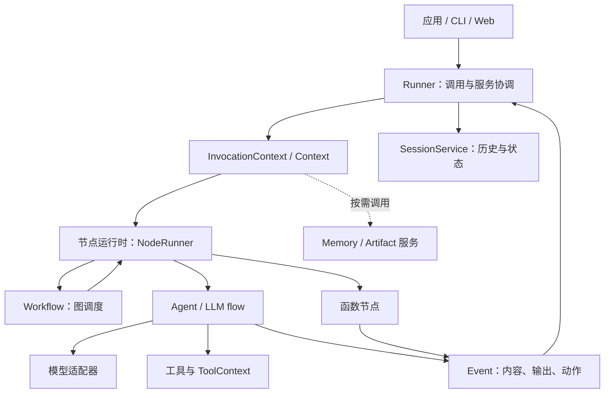

# Google ADK 源码剖析

**从一条请求出发，读懂 Agent、工具、状态和工作流。**

这是一个面向 Python 开发者与技术选型者的中文学习仓库。通过固定版本源码、三张架构图和四个可运行示例，解释 Google Agent Development Kit 是什么、怎样执行、适合什么场景，以及真正使用时还缺哪些工程环节。阅读目标是能找到代码入口、解释一次运行，并作出有依据的选型判断。

本项目是独立社区分析，不隶属于 Google，不替代官方文档。分析基线为 **ADK v2.10.0**，提交 `53b3706e04fab34d1d53808a5f62cfe9b025f893`；源码与竞品资料核查日期为 **2026-09-29**。后续版本行为可能变化，请先看[证据索引](docs/references.md)。目前仅本地交付，尚未发布 GitHub 仓库。

## 它是什么

ADK 是以代码定义 Agent、工具及编排的开发工具包。Agent 声明行为，Runner 协调执行，Session 服务维护会话，Workflow 把函数与 Agent 组成图。它把模型调用接进可观察的程序，应用继续负责业务权限、外部动作和部署策略。

核心理念可以概括为行为与执行分离、事件贯穿运行、模型和服务可替换。这带来组合能力，也增加了模式、上下文与状态边界的学习成本。“能写一个 Agent”与“能可靠运行一个服务”之间仍有工程工作。[详细概览](docs/overview/index.md)

## 架构总览

实线表示调用或事件流，虚线表示可选服务访问；不是继承图。应用经 Runner 驱动节点，Workflow 调度图内节点，Agent 调用模型和工具，事件回到 Runner 保存到会话。具体调用分支见[架构导航](docs/architecture/index.md)。
