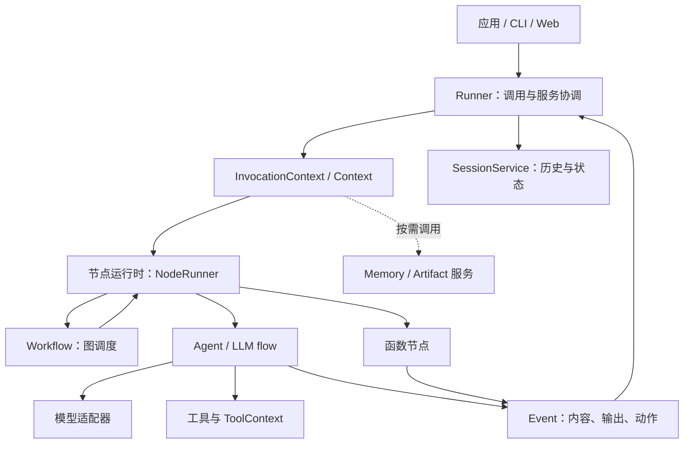

# Google ADK 源码剖析

**从一条请求出发，读懂 Agent、工具、状态和工作流。**

这是一个面向 Python 开发者与技术选型者的中文学习仓库。通过固定版本源码、三张架构图和四个可运行示例，解释 Google Agent Development Kit 是什么、怎样执行、适合什么场景，以及真正使用时还缺哪些工程环节。阅读目标是能找到代码入口、解释一次运行，并作出有依据的选型判断。

本项目是独立社区分析，不隶属于 Google，不替代官方文档。分析基线为 **ADK v2.10.0**，提交 `53b3706e04fab34d1d53808a5f62cfe9b025f893`；源码与竞品资料核查日期为 **2026-09-29**。后续版本行为可能变化，请先看[证据索引](docs/references.md)。目前仅本地交付，尚未发布 GitHub 仓库。

## 从哪里开始

| 读者 | 建议路径 | 读完应能回答 |
| --- | --- | --- |
| Python 开发者 | [概览](docs/overview/index.md) → [工具示例](examples/01-tool-agent/README.md) → [请求链](docs/architecture/request-lifecycle.md) → [状态与恢复](docs/architecture/state-and-events.md) | 工具是谁调用的？数据保存在哪？暂停后怎样继续？ |
| 技术选型者 | [选型边界](docs/overview/selection-guide.md) → [框架比较](docs/comparison/framework-tradeoffs.md) → [生产决策](docs/getting-started/production-checklist.md) | 框架承担什么？额外依赖有哪些？哪些结论仍需实测？ |

不必一开始遍历所有模块。先运行一个示例，看见事件与结果，再回到对应源码。每篇专题给出机制、证据和限制；术语不熟时查看[词汇表](docs/overview/glossary.md)。

## 它是什么

ADK 是以代码定义 Agent、工具及编排的开发工具包。Agent 声明行为，Runner 协调执行，Session 服务维护会话，Workflow 把函数与 Agent 组成图。它把模型调用接进可观察的程序，应用继续负责业务权限、外部动作和部署策略。

核心理念可以概括为行为与执行分离、事件贯穿运行、模型和服务可替换。这带来组合能力，也增加了模式、上下文与状态边界的学习成本。“能写一个 Agent”与“能可靠运行一个服务”之间仍有工程工作。[详细概览](docs/overview/index.md)

## 架构总览



实线表示调用或事件流，虚线表示可选服务访问；不是继承图。应用经 Runner 驱动节点，Workflow 调度图内节点，Agent 调用模型和工具，事件回到 Runner 保存到会话。具体调用分支见[架构导航](docs/architecture/index.md)。

## 它能做什么

| 能力 | 框架机制 | 进一步阅读 |
| --- | --- | --- |
| 工具与多模型 | FunctionTool、BaseLlm、扩展集成 | [工具、模型与协议](docs/capabilities/tools-and-models.md) |
| 多 Agent 与流程 | 子 Agent、Workflow、规则或模型路由 | [Agent 与 Workflow](docs/capabilities/agents-and-workflows.md) |
| 状态、记忆与审批 | Session/State、Memory、Artifact、RequestInput | [数据与人工介入](docs/capabilities/state-memory-and-hitl.md) |
| 评估、观测、实时与部署 | EvalSet、事件/插件/trace、run_live、部署入口 | [工程能力及条件](docs/capabilities/evaluation-observability-deployment.md) |

这些能力的依赖条件不同。核心包的本地工具闭环与连接 MCP、A2A、实时模型、云平台不是同一个验证层级；安装额外依赖也不等于完成账号、权限和运行配置。

## 它特别在哪

ADK 的特色是把交互 Agent、显式工作流、统一事件、会话服务和 Google 生态入口放进同一工具包。它不是唯一拥有审批、类型输出或持久化的框架。

| 候选 | 本仓库关注的设计重心 | 选型时应核实 |
| --- | --- | --- |
| ADK | Agent 与图编排、事件和服务的组合 | 运行模式及后端边界 |
| LangGraph | 显式状态图、checkpoint 与 interrupt | 状态归并、节点重跑及 saver |
| OpenAI Agents SDK | Agent/Runner、工具、handoff 与 tracing | Session/RunState、模型及平台关系 |
| PydanticAI | 类型化 Agent、依赖、工具与输出 | 提供商、持久执行引擎与实时配置 |
| CrewAI | 角色任务协作与 Flow | checkpoint、反馈渠道与部署选项 |

[完整比较](docs/comparison/framework-tradeoffs.md)使用八个统一维度，记录四个竞品的版本与提交，并区分内置、扩展、托管和应用实现。没有跨框架性能或价格测试，因此不宣称哪一个绝对更快或更便宜。

## 十分钟离线上手

准备 Python 3.12 和 [uv](https://docs.astral.sh/uv/getting-started/installation/)，在本仓库根目录运行。首次同步依赖需要网络；以下示例执行不需要模型 Key。

```sh
uv sync --locked --python 3.12
uv run python examples/01-tool-agent/main.py --offline
uv run python examples/02-session-state/main.py --offline
uv run python examples/03-workflow-routing/main.py --text '你好？'
uv run python examples/04-human-in-the-loop/main.py --decision approve
uv run python examples/04-human-in-the-loop/main.py --decision reject
```

天气示例应输出“杭州：晴，24°C”；计数器应得到 [1,2]、1、1；路由只访问 question；审批先暂停，批准记录一次本地动作，拒绝零次。前两个示例以确定性模型响应替代远程模型，其余仍使用真实 Runner、工具和会话接口；后两个示例由确定函数驱动。

完整代码在各示例目录，不需要从文档拼接片段。默认离线适合看清机制，真实模型输出没有确定性保证。尝试在线模式前请读[环境与配置](docs/getting-started/environment.md)，本项目没有执行在线模型调用。

## 文档地图与验证范围

- [项目概览](docs/overview/index.md)：定位、核心理念、术语和适用边界。
- [架构设计](docs/architecture/index.md)：请求时序、状态图和源码地图。
- [核心功能](docs/capabilities/index.md)：机制、依赖与局限。
- [特性与比较](docs/comparison/index.md)：版本证据和场景取舍。
- [使用与上手](docs/getting-started/index.md)：安装、运行、调试和生产决策。

[验证记录](docs/validation.md)区分已运行检查和未覆盖能力。确定性测试证明示例的控制流，不证明真实模型质量；内存后端不证明生产持久化，审批示例也不证明外部事务 exactly-once。文档的事实、官方描述与分析判断分别给出依据，欢迎按[贡献指南](CONTRIBUTING.md)补充可复核证据。

原创文档、图与示例采用 [Apache-2.0](LICENSE)；来源与许可说明见[第三方声明](THIRD_PARTY_NOTICES.md)。
