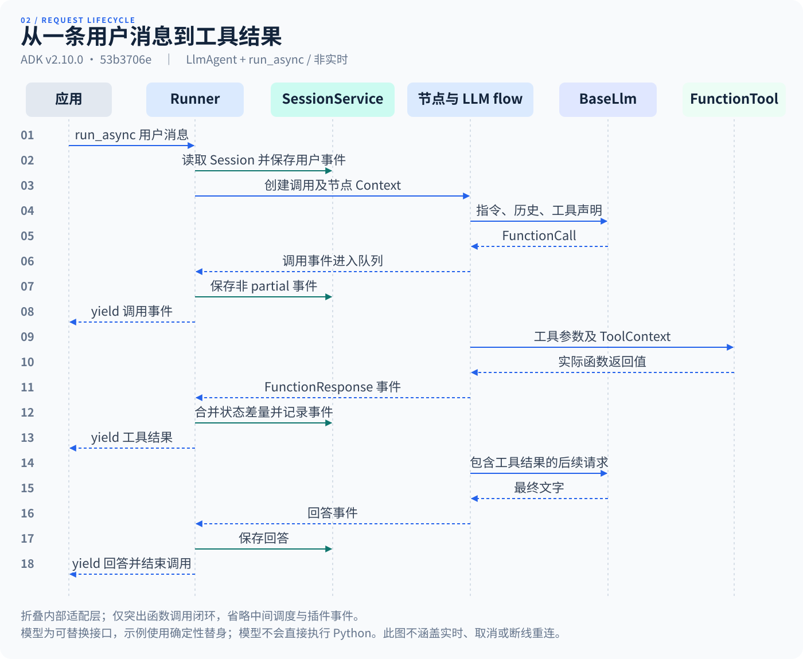
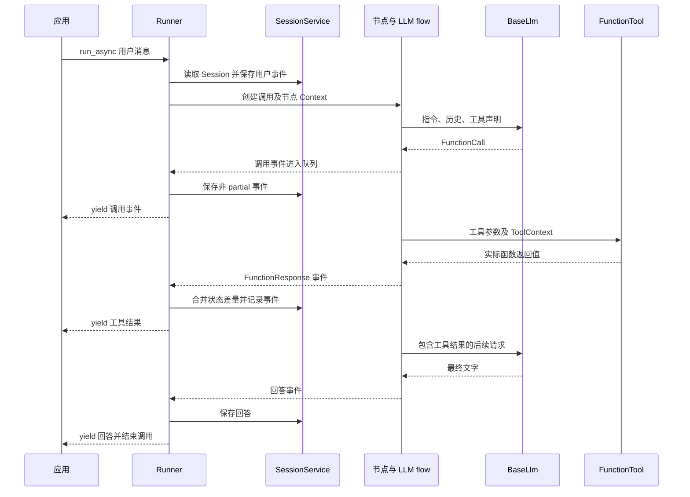

# 从一条用户消息到工具结果

分析对象是示例 01 的根 LlmAgent + run_async，默认非实时调用。来源固定于 v2.10.0；[源码地图](source-map.md)标出每个主要入口。

## 主调用链

1. 应用创建或指定 Session，调用 Runner.run_async(user_id, session_id, new_message)。Runner 解析根 Agent 模式并选中节点路径。
2. `_run_node_async` 委托 `_node_runner_utils.run_node_async`：查找会话，解析恢复输入，建立 InvocationContext 和事件队列，保存用户消息，创建根 Context。
3. Context 的节点调度进入 NodeRunner，后者为执行节点建立子 Context，调用 BaseNode.run。Workflow 自身是节点，其内部还按边调度其他节点。
4. LlmAgent 的节点包装器衔接原有 Agent/LLM flow。BaseLlmFlow 先整理历史内容、指令、工具声明及回调，再向 BaseLlm 请求响应。
5. 模型返回 FunctionCall；工具处理流程查找工具并经 FunctionTool.run_async 调用 Python 函数。返回值组成 FunctionResponse，再进入后续模型请求。
6. NodeRunner 把事件放入调用队列。Runner 消费事件，经插件处理后保存非 partial 事件，再向应用 yield。调用完成后执行清理；应用需完整消费或正确关闭生成器。

这些步骤分别对应 [runners.py:1028](https://github.com/google/adk-python/blob/53b3706e04fab34d1d53808a5f62cfe9b025f893/src/google/adk/runners.py#L1028)、[_node_runner_utils.py:69](https://github.com/google/adk-python/blob/53b3706e04fab34d1d53808a5f62cfe9b025f893/src/google/adk/workflow/_node_runner_utils.py#L69)、[_node_runner.py:115](https://github.com/google/adk-python/blob/53b3706e04fab34d1d53808a5f62cfe9b025f893/src/google/adk/workflow/_node_runner.py#L115)、[_llm_agent_wrapper.py:391](https://github.com/google/adk-python/blob/53b3706e04fab34d1d53808a5f62cfe9b025f893/src/google/adk/workflow/_llm_agent_wrapper.py#L391)、[base_llm_flow.py:389](https://github.com/google/adk-python/blob/53b3706e04fab34d1d53808a5f62cfe9b025f893/src/google/adk/flows/llm_flows/base_llm_flow.py#L389)、[function_tool.py:357](https://github.com/google/adk-python/blob/53b3706e04fab34d1d53808a5f62cfe9b025f893/src/google/adk/tools/function_tool.py#L357)、[runners.py:750](https://github.com/google/adk-python/blob/53b3706e04fab34d1d53808a5f62cfe9b025f893/src/google/adk/runners.py#L750)。

## 请求时序图

图中“节点与 LLM flow”折叠了内部适配层。模型是可替换接口；示例用确定性替身。每批可见事件均由 Runner 消费，图仅突出函数调用闭环，省略中间调度与插件事件。

查看 Mermaid 图定义

文字替代：用户消息先进入会话；节点把模型的工具请求转交真实工具；工具结果回到模型；Runner 沿途保存事件并转交应用。模型不会直接执行 Python。

## 用事件检验理解

[示例 01](../../examples/01-tool-agent/README.md)断言真实 FunctionCall 的名称和参数、存在 FunctionResponse、最终文字读取实际返回数据。若只断言“最终回答有天气”，硬编码一句话也能通过；检查调用及结果能排除这种假象。

[示例 03](../../examples/03-workflow-routing/README.md)还显示：函数节点的 event.author 可以是工作流名称，精确节点位置应查看 node_info.path。Event(route=...) 是构造便捷参数，读取走 actions.route；state 同样归入 actions.state_delta。[转换定义](https://github.com/google/adk-python/blob/53b3706e04fab34d1d53808a5f62cfe9b025f893/src/google/adk/events/event.py#L164)

## 普通流式与实时不是一回事

run_async 可以传递 partial 文本事件；run_live 使用 LiveRequestQueue 与连接生命周期处理双向输入。BaseLlmFlow 在 support_cfc 分支会交给 live 路径，避免再次后处理导致工具重复执行。不能把 run_async 的这一张图当成音频或 CFC 的完整图。[run_live 入口](https://github.com/google/adk-python/blob/53b3706e04fab34d1d53808a5f62cfe9b025f893/src/google/adk/runners.py#L1579)与[CFC 分支](https://github.com/google/adk-python/blob/53b3706e04fab34d1d53808a5f62cfe9b025f893/src/google/adk/flows/llm_flows/base_llm_flow.py#L439)

本仓库尚未建立真实模型连接，实时、取消、断线重连与生产级错误恢复只做源码分析。工具超时、重试和幂等仍需要业务策略。
