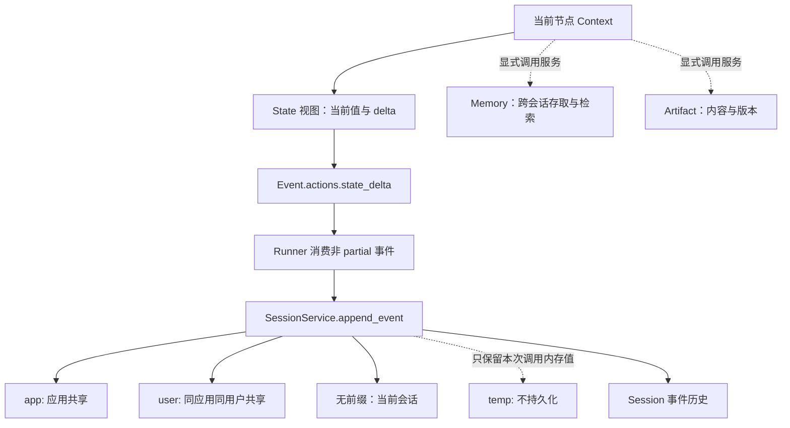

# 状态、事件与暂停恢复的边界

一个共享 Agent 不应拥有某个用户的会话变量。状态从 Context 进入 State 视图，变化进入 EventActions，再由会话服务保存。这个边界决定复用是否安全、恢复能重建什么。

## 状态边界图

实线表示状态提交或保存路径，虚线表示非持久临时值或另行调用的服务；Memory、Artifact 不会因普通 State 写入而自动更新。文字替代：节点提交差量，服务按前缀分配范围，历史记录支持后续执行；长期记忆和文件保存各走自己的接口。

## 一次 counter 更新到底写到哪里

[示例 02](../../examples/02-session-state/README.md)的工具给 tool_context.state["counter"] 赋值。State 同时维护当前值和待提交差量；随后事件携带变化，Runner 的非 partial 事件经过 append_event，InMemory 后端更新保存副本。示例每次重新 get_session，读取的是服务返回的数据，而不是工具闭包中的临时字典。

同一个 Runner 的测试得到 [1,2]、1、1：同会话连续累加，不同 session 或不同 user 不串数据。这仅覆盖无前缀键的串行行为，未测试同会话并发冲突或共享前缀。[State 定义](https://github.com/google/adk-python/blob/53b3706e04fab34d1d53808a5f62cfe9b025f893/src/google/adk/sessions/state.py#L72)、[后端写回](https://github.com/google/adk-python/blob/53b3706e04fab34d1d53808a5f62cfe9b025f893/src/google/adk/sessions/in_memory_session_service.py#L333)

## temp、Memory 和 Artifact

BaseSessionService.append_event 先把 temp 值应用到本轮内存状态，再从持久化的事件差量中移除。不能通过“历史里没找到 temp”推断同一轮后续节点看不到它。[过滤顺序](https://github.com/google/adk-python/blob/53b3706e04fab34d1d53808a5f62cfe9b025f893/src/google/adk/sessions/base_session_service.py#L166)

Memory 的 add_session_to_memory / search_memory 是独立动作，检索策略取决于后端；不保证每次对话结束自动提炼记忆。Artifact 的 save/load 和版本列表管理内容对象；需要明确何时装载并交给模型。[Memory 接口](https://github.com/google/adk-python/blob/53b3706e04fab34d1d53808a5f62cfe9b025f893/src/google/adk/memory/base_memory_service.py#L44)、[Artifact 接口](https://github.com/google/adk-python/blob/53b3706e04fab34d1d53808a5f62cfe9b025f893/src/google/adk/artifacts/base_artifact_service.py#L87)

## RequestInput 的恢复链

[示例 04](../../examples/04-human-in-the-loop/README.md)先 yield RequestInput。框架把它转成带 long_running_tool_ids 的函数调用事件，调用暂停，事件流正常结束；这与 Python 进程一直阻塞等待键盘输入不同。

应用保存真实 call.id、call.name 与 invocation_id，用同会话的 FunctionResponse 返回 {"result": "approve"} 或 reject。恢复逻辑匹配历史请求并解包 result，等待节点的结果进入后续路由。批准分支才执行一次本地列表追加；拒绝分支不执行动作。

节点是否重跑涉及 rerun_on_resume、已保存的节点信息与执行历史。不能一概承诺“从暂停的 Python 行继续”，也不能将 HITL 示例理解成跨进程事务恢复。[RequestInput](https://github.com/google/adk-python/blob/53b3706e04fab34d1d53808a5f62cfe9b025f893/src/google/adk/events/request_input.py#L28)、[解包](https://github.com/google/adk-python/blob/53b3706e04fab34d1d53808a5f62cfe9b025f893/src/google/adk/workflow/utils/_rehydration_utils.py#L100)、[上游测试](https://github.com/google/adk-python/blob/53b3706e04fab34d1d53808a5f62cfe9b025f893/tests/unittests/workflow/test_function_node.py#L433)

## 生产边界

Session 标识不是授权凭证；前缀不是租户隔离策略；保存事件与外部支付、发信、写业务表之间没有自动分布式事务。恢复时应对动作建立稳定业务 ID、幂等记录和审批身份校验。InMemory 的当前验证不能外推为数据库、跨进程恢复或 exactly-once 保证。
